# 基于ds1307的定时开关Demo
基于ds1307的定时开关Demo，支持手机遥控开关；手机设定好定时任务后，设备则可自动实现定时开关的任务。  
当前实现定时任务的方案主要有两种：一种主要由服务端实现，另外一种主要由本地实现。这里的定时任务的实现是后一种。    
本地实现定时任务也有两种方案，一种是使用MCU本身的RTC功能，另外一种是使用外加的RTC模块。这里采用的方案是后一种。  
采用DS1307作为定时器的优势：
- 本地定时，时间可以不受服务器影响；  
- 本地时间不受断电影响，定时的时间由DS1307提供，DS1307由本地的纽扣电池提供电源（当然，电池没电是需要更换电池的:）；
- 断网的情况下，任务仍然可以继续；
- DS1307是性价比比较高的RTC时钟，用途非常广泛，一般两三块钱一个模块。

采用本地定时方案的缺点：  
- 需要处理一定的业务逻辑，比如，定时逻辑等。相应的，任务越复杂，业务逻辑也越复杂；  
- 需要调试实现相关的驱动。

当前该Demo只实现了单任务。
手机端涉及的功能有：  
- 遥控开关；  
- 查看设备时间、设置设备时间；  
- 查看设备任务、设置设备任务。    
    
根据功能设计界面，先看手机freeiot上的界面效果图：  
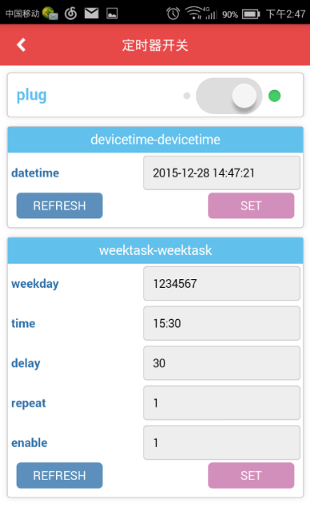   

Tisan开发板与Ds1307模块的连接图：  
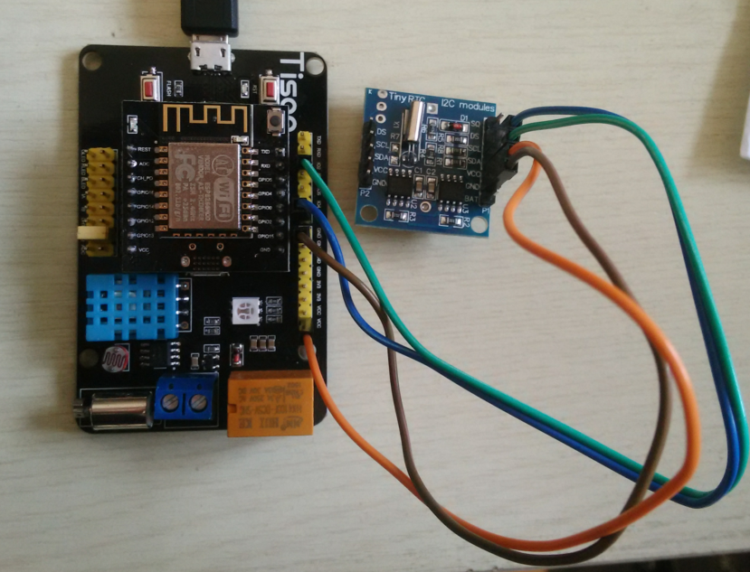   
   
# 1 准备  
首先，作为一个Tisan开发者，当然要使用Tisan的WebIDE了，这是进行框架开发的必备条件，WebIDE的其他用处暂不多说哈。  
WebIDE的官网：[http://tisan.pandocloud.com/](http://tisan.pandocloud.com/)   
tisan-doc: [tisan-doc](https://sw0813.gitbooks.io/tisan-doc/content/)  
相关的视频教程： [http://i.youku.com/u/UMTIwNTA2MTM2MA==](http://i.youku.com/u/UMTIwNTA2MTM2MA==)  
Tisan论坛链接：[http://bbs.elecfans.com/zhuti_820_1.html](http://bbs.elecfans.com/zhuti_820_1.html)   

## 1.1 硬件  
1. Tisan开发板；  
2. 能上网的wifi路由；  
3. 能上wifi的手机（^^)，支持安卓和iOS；  
4. PC。  
5. RTC模块（芯片为DS1307），可以到淘宝上购买；[资料链接](http://note.youdao.com/share/?id=df2c60ad9b7544865d2abd1619f75049&type=note)    
6. 一些杜邦线。  

## 1.2 软件  
1. 在PC上下载固件开发的IDE，可到资源中心下载：[http://pan.baidu.com/s/1c0r0ba4](http://pan.baidu.com/s/1c0r0ba4), 具体的开发环境介绍可参考[tisan开发环境介绍](https://sw0813.gitbooks.io/tisan-doc/content/cn/environment.html)  
2. 安装freeiot，下载链接和使用说明请参考[快速体验](https://sw0813.gitbooks.io/tisan-doc/content/cn/quick-start.html)    
3. 如果想用微信控制，可先关注微信公众号：freeiot。  
4. 准备固件烧录工具，也在资源中心下载。  
5. 到开源项目管理网站github下载tisan-demo的源代码：[https://github.com/tisan-kit/tisan-demo/archive/master.zip](https://github.com/tisan-kit/tisan-demo/archive/master.zip)。  
  

# 2 搭建硬件环境  
参考DS1307模块的原理图，Tisan开发板与模块连线如图所示：  
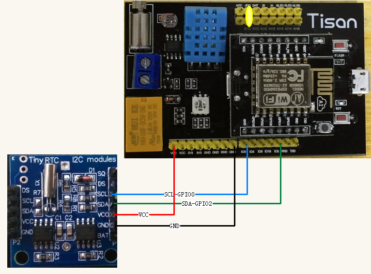  
> 注意我们用了继电器，将上面的IO口复用的地方，用跳帽连接好。  

# 3 在WebIDE上创建产品  
## 3.1 创建定时器开关产品  
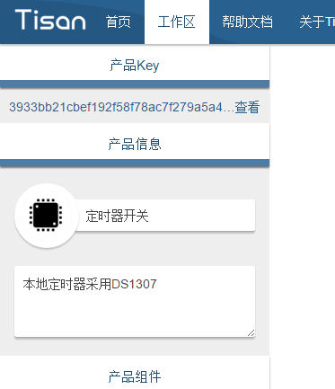  
创建后需要保存，否则产品无效。     
## 3.2 添加object组件  
根据应用，需要添加三个object组件：开关object、时间object、任务object。开关object是公共组件，而后面两个object不在公共组件内，需要自定义。  
先添加开关object：  
  
打开自定义组件，定义一个时间组件，采用字符串的形式，这里我们规范好字符串格式：20xx-MM-DD HH:mm:ss   
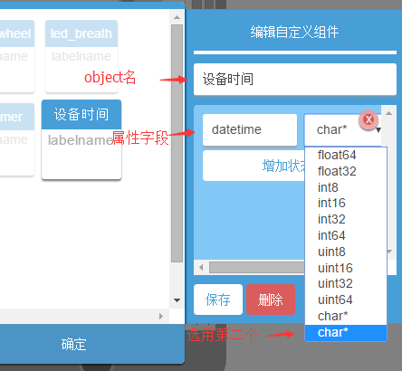  
> 注意，要选择第二个char*，否则会有问题。  

添加了时间组件后，再打开自定义组件，定义一个周任务组件，有点类似于闹钟任务。对周任务我们进行定义相关的字段：周几、时间（时:分）、执行任务多久、是否每周重复、是否启用。  
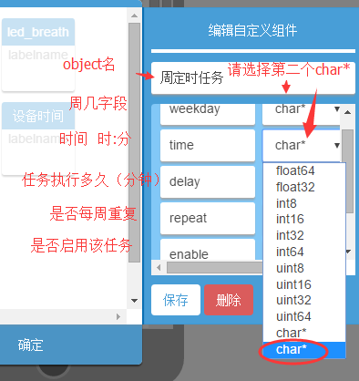   
> 注意，要选择第二个char*，否则会有问题。 
 
添加周任务组件。  
对添加的组件进行更改Label  
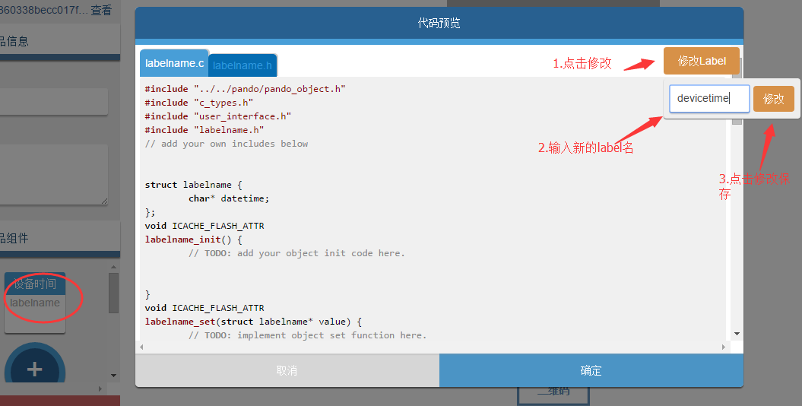  
还有：  
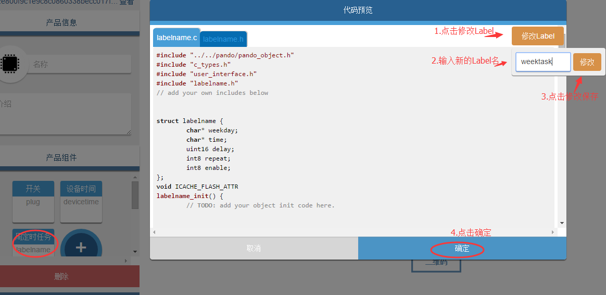  

## 3.3 WebIDE设计界面整体图  
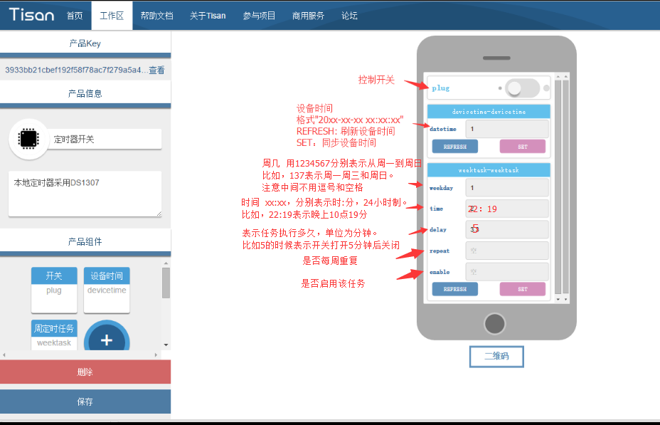  

## 3.4 最后保存  
点击保存，WebIDE的产品工作区右边的控制界面会更新。  

# 4 固件开发  
在固件开发的IDE上导入下载的 Tisan-demo 源码工程，如图：  
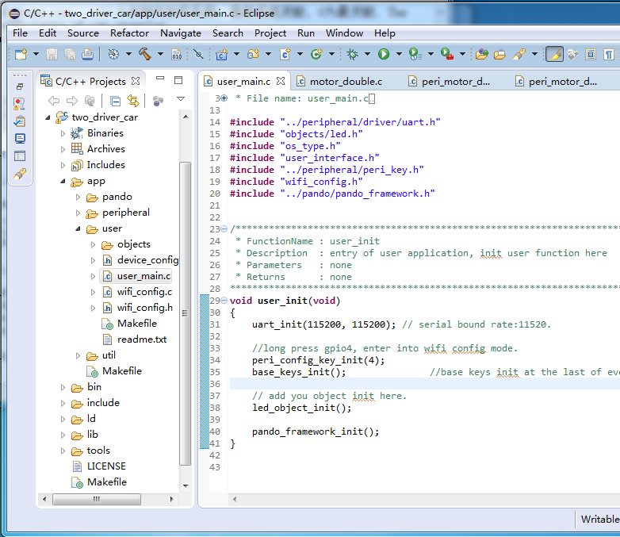  

## 4.1 更新产品Key  
复制WebIDE上创建的产品key到device_config.h 文件中：  
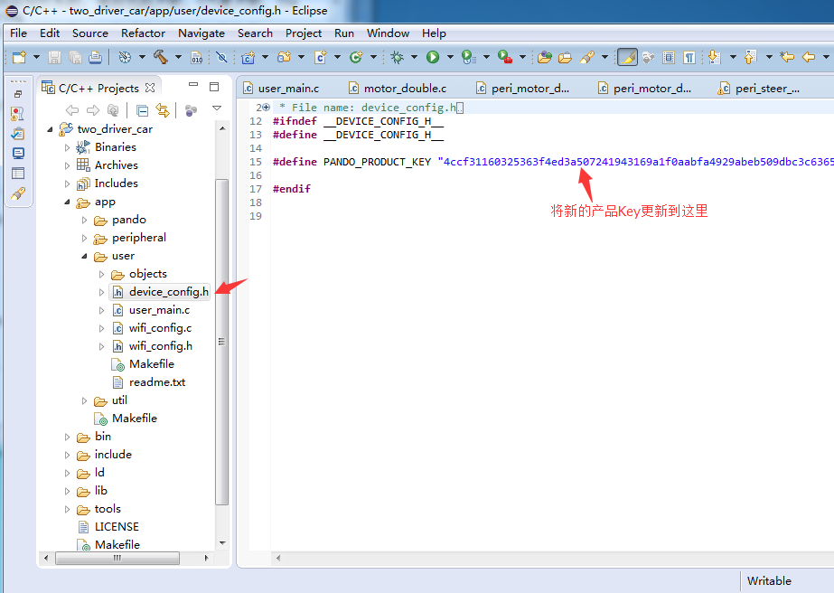   

## 4.2 处理产品对象代码  
将WebIDE上创建的产品对象（plug, devicetime, 和weektask）的代码复制添加到app/user/objects 目录下，如图：  
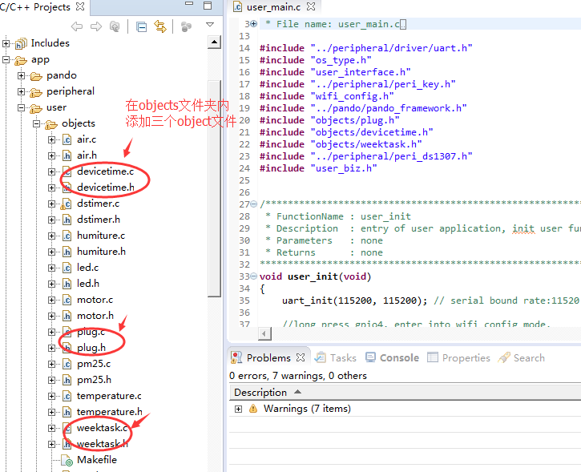  

## 4.3 外设与驱动开发  
为了支持object的功能，需要进行相应的外设驱动开发。本应用设计到RTC外设以及继电器外设，继电器外设驱动已经有了，这里需要对DS1307进行外设驱动开发，主要是进行IIC接口的驱动开发。  
添加相应object的外设文件，plug的外设驱动文件都已经有了，可以直接调用，这里需要创建devicetime和weektask的外设文件，另外需要对DS1307进行驱动开发。  
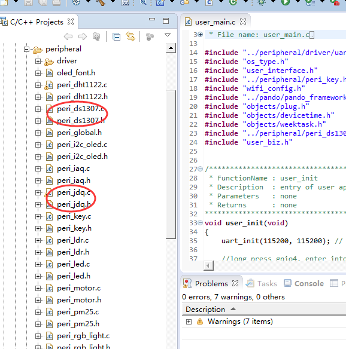  
> 相关的代码文件可以参考工程里面*app/peripheral*目录下的 peri_ds1307.c，peri_ds1307.h，与 peri_jdq.c, peri_jdq.h外设文件，驱动文件可参考*app/peripheral/driver*目录下的 i2c_ds1307.c，i2c_ds1307.h。  
> 我们在这里还另外补充了一下代码，比如在*util*目录下对 converter.c 和 converter.h 补充了一些编码转换需要用到的工具函数，以及添加了用于日历管理的工具文件：calendar.c 和 calendar.h 文件。  


## 4.4 处理业务逻辑  
由于需要处理本地定时开关的任务，所以需要处理该任务逻辑。业务逻辑的代码放在*app/user*目录下，在这里我们增加了 user_biz.c，user_biz.h 文件，用于处理业务逻辑。具体的实现可参考工程里面的代码。  

## 4.5 处理*user_main.c*文件  
在*user_main.c*文件里引用对象和业务头文件：  
```c
#include "objects/plug.h"
#include "objects/devicetime.h"
#include "objects/weektask.h"
#include "user_biz.h"
```  

在入口函数*user_init(void)里面调用如下：  
```c
void user_init(void)
{
	uart_init(115200, 115200); // serial bound rate:11520.

	//long press gpio4, enter into wifi config mode.
	peri_config_key_init(4);
	base_keys_init();               //base keys init at the last of every single key init.
	//auto_check_connect_init();

	// add you object init here.
	plug_object_init();
	DeviceTime_object_init();
	weektask_object_init();

	//biz
	task_timer_set();

	pando_framework_init();
}

```  

# 5 编译并烧录固件  
编译和烧录固件请参考 tisan-doc 的开发环境介绍。  
烧录成功后，复位开发板，板子即正常运行。  
# 6 配置开发板上网并且添加设备  
添加设备后可以刷新设备时间，如果时间不对，可以自行设置时间，注意时间格式一定要符合要求，比如：2015-12-28 10:35:30   


# 不足和需要改善的地方  
- 处理业务逻辑的代码似乎还可以再优化；  
- 现在是处理单任务，如何扩展多任务；  
- 设置任务的时候，板子会重启，应该是写flash的时候存在bug；  
- WebIDE关于字符串的组件生成代码有问题，比如要用到 add_next_uri，而不是 add_next_bytes  
- 框架中写 flash 的流程和调用似乎可以更方便一点，当前使用起来感觉还是不太好用，比如在有多个object都需要读写Flash的时候，开发者还要去关注哪个扇区号，不能直接操作哪个object对应的flash的时候自动把扇区号加上去（因为object的id都是唯一的）。  
- 放一些实际的应用，比如定时浇花、定时开灯；   


